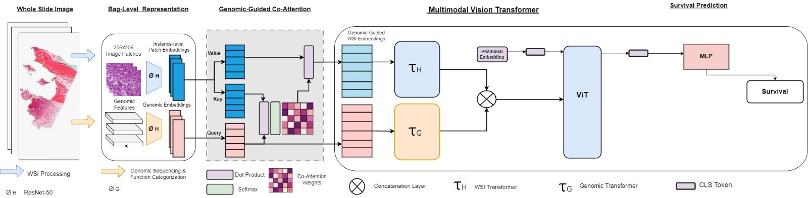

MCAT-HViT: Multimodal Co-Attention Hierarchical Transformer for Survival Prediction
===========
<details>
<summary>
  <b>MCAT-HViT: Multimodal Co-Attention Hierarchical Transformer for Survival Prediction</b>
  <br><em>Saporita Alessia, Jelali Abeer, Berselli Elena</em></br>
</summary>

```bash
@inproceedings{
  title={MCAT-HViT: Multimodal Co-Attention Hierarchical Transformer for Survival Prediction},
  author={Saporita Alessia, Jelali Abeer, Berselli Elena},
  year={2023}
}
```
</details>

**Summary:** We develop a multimodal co-attention hierarchical transformer able to predict whether ovarian cancer patients will survive more than 42 months. The threshold has been set empirically to 42 months based on our data distribution. However it can be tailored according to one's specific requirements. The survival is predicted via: 1) formulating both WSIs and genomic inputs as embedding-like structures, 2) using co-attention mechanism that learns pairwise interactions between instance-level histology patches and genomic embeddings, 3) fusing modalities by processing the embeddings with a transformer encoder that applies multi-head self-attention to all input tokens, thus allowing cross-modality information transfer and 4) reducing the noise contained in histology patches by randomly set to zero the visual embedding with probability chosen to be 30%.

 architecture

### Pre-requisites:
Please refer to our [Installation guide](INSTALLATION.md) for detailed instructions on how to get started.

### Data
Please download WSIs and molecular data from [NIH Genomic Data Commons Data Portal](https://portal.gdc.cancer.gov/). WSIs for ovary cancer can be downloaded using the [GDC Data Transfer Tool](https://docs.gdc.cancer.gov/Data_Transfer_Tool/Users_Guide/Data_Download_and_Upload/). 

## Processing Whole Slide Images
[CLAM](https://github.com/mahmoodlab/CLAM) is used to process WSIs: 256 x 256 patches without spatial overlapping are extracted and given as input to a pretrained truncated ResNet50 to encode raw image patches into 1024-dim feature vectors. The following folder structure is assumed for the extracted features vectors:   

```bash
DATA_ROOT_DIR/
    └──pt_files/
        ├── slide_1.pt
        ├── slide_2.pt
        └── ...
```
DATA_ROOT_DIR is the base directory. Within DATA_ROOT_DIR, the 'pt_files' folder contains the .pt files corresponding to the extracted features vectors.  

## Processing Molecular Data
For preprocessing molecular data we applied log2 to gene expression values and  we filtered for coding genes following [GeneNames](https://www.genenames.org/download/statistics-and-files/). For ordering gene features into gene embeddings, we used the following categorization of gene families from [MSigDB](https://www.gsea-msigdb.org/gsea/msigdb/gene_families.jsp?ex=1) as presented in [MCAT](https://github.com/mahmoodlab/MCAT).

## Training-Validation Splits
For evaluating the algorithm's performance, we randomly partitioned each dataset using 5-fold cross-validation. Splits for ovary cancer are found in the [splits/5foldcv](https://github.com) folder which contains **splits_{k}.csv** for k = 1 to 5. In each **splits_{k}.csv**, the first column corresponds to the TCGA Case IDs used for training, and the second column corresponds to the TCGA Case IDs used for validation. To create these train-val splits please refer to the [**generate_splits.py**](https://github.com/alessiasaporita/MCAT-HViT/tree/main/utilities) file and the generate_split function in [**utilities/utils.py**](https://github.com/alessiasaporita/MCAT-HViT/tree/main/utilities).


## Running Experiments
To run experiments using the SNN, MCAT, MCAT-HViT and MCAT-ViT networks defined in this repository, the following generic command-line can be run:
```shell
CUDA_VISIBLE_DEVICES=<DEVICE ID> python main.py --which_splits <SPLIT FOLDER PATH> --split_dir <SPLITS FOR OVARY CANCER> --mode <WHICH MODALITY> --model_type <WHICH MODEL> 
```
Commands for all experiments / models can be found in the [Commands.md](Commands.md) file.
The --met option specifies the possibility to train the models with also methylation beta values. 


## Contact Us
Alessia Saporita - [GitHub](https://github.com/alessiasaporita)
Abeer Jelali - 
Berselli Elena - 
 
